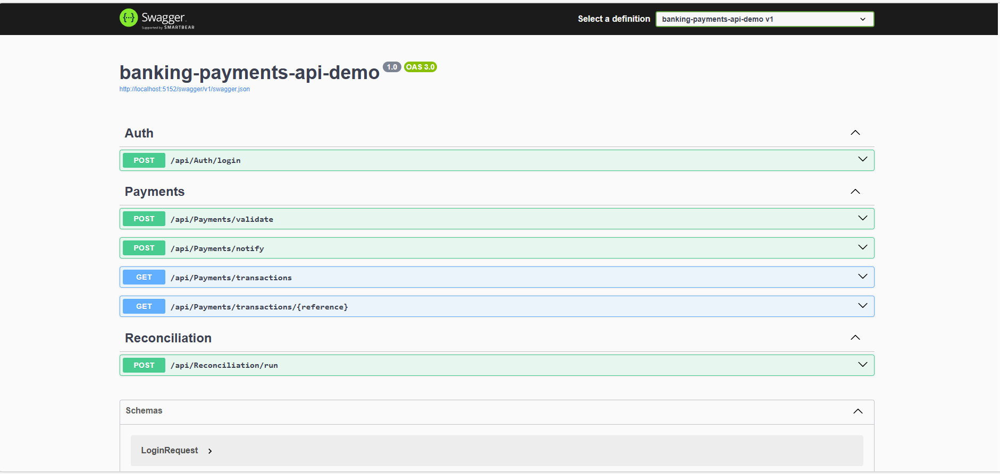
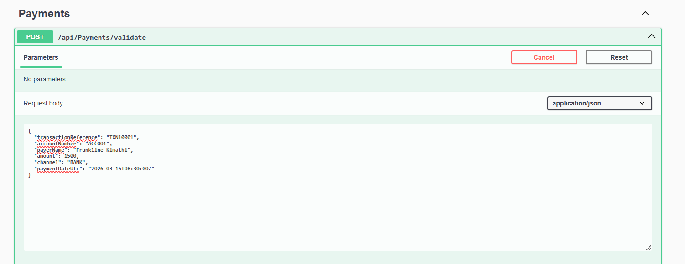
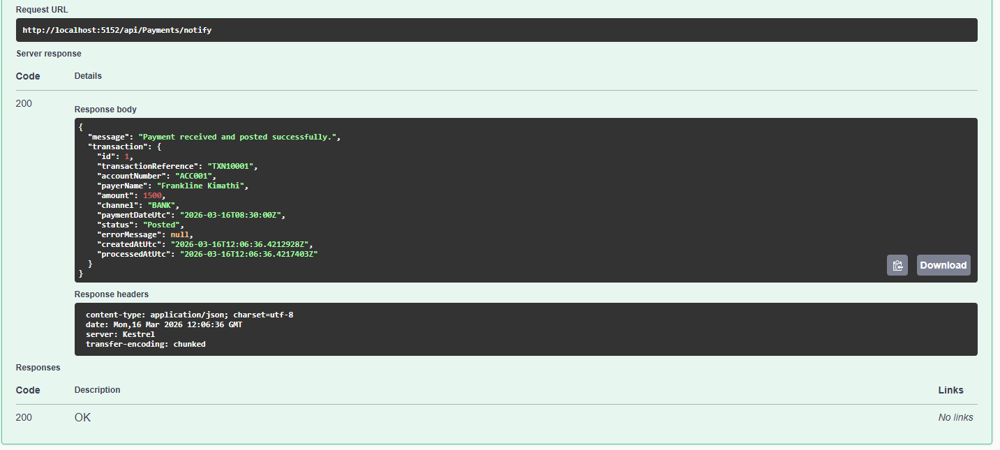
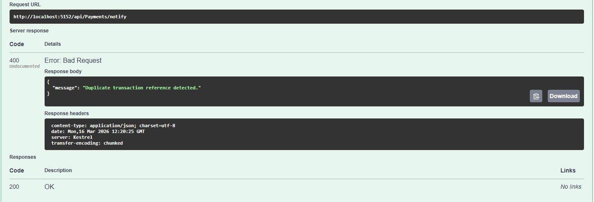
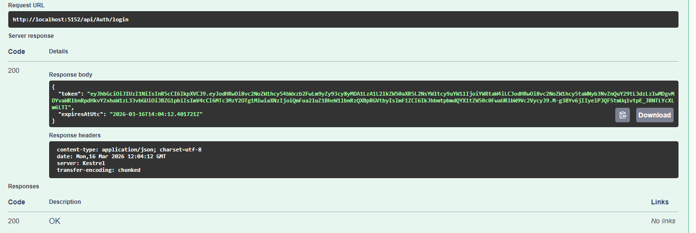
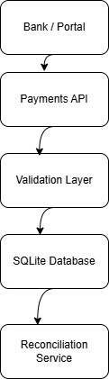

# Banking Payments API Demo

A sample ASP.NET Core Web API that demonstrates transaction intake, duplicate prevention, payment validation, JWT-secured admin endpoints, reconciliation reporting, and webhook logging.

## Features

- Payment validation endpoint
- Payment notification endpoint
- Duplicate transaction prevention
- Pending → Posted / Failed transaction lifecycle
- JWT authentication
- Transaction history
- Reconciliation summary with counts and totals
- Webhook logging
- SQLite persistence
- Swagger documentation

## Tech Stack

- C#
- ASP.NET Core Web API
- Entity Framework Core
- SQLite
- JWT Authentication
- Swagger

## Endpoints

### Auth
- `POST /api/auth/login`

### Payments
- `POST /api/payments/validate`
- `POST /api/payments/notify`
- `GET /api/payments/transactions`
- `GET /api/payments/transactions/{reference}`

### Reconciliation
- `POST /api/reconciliation/run`

## Screenshots

### API Documentation (Swagger)



### Payment Validation Request



### Payment Notification Success



### Duplicate Transaction Prevention



### Admin Authentication



## Architecture



## Demo Credentials

```json
{
  "username": "admin",
  "password": "Admin@123"
}